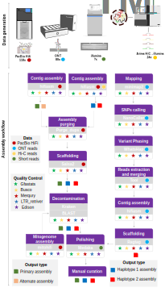

## Raw summary of methods used in the T2T assembly of the African catfsih genome 

Here, we document all steps to achieve chromosome-level telomere-to-telomrere (T2T) assembly, from the input data to the final hplotype-resolved, 
gap-filled and polished asemblies.

### Summary of generated sequencing data
DNA for all samples was extracted from tissues of the same single male adult animal (fish).\

- **HiFi reads:**
High fildelity (HiFi) reads data were produced using the circular consensus sequencing (CCS) mode of the PacBio Sequel systems. 
A total of 8,509,466 CCS reads with an avearge N50 reads length of ~16 Kb were yielded, achieving an overall genome coverage of 118x. HiFi reads have an average base-level accuracy of >99.6% (Q25). These data were mainly used to compute the primary assemblies.
- **ONT reads:** Oxford Nanopre Technologies (ONT) long reads were additionally produced on a PromethION 2 system. A total of 4,067,755
ONT reads wih N50 of 32 Kb and mean quality of >90% (Q10). ONT reads yielded an average genome coverage of 80x. Nanopore data were mainly utilized in haplotype phasing and to fill the gaps in the chomomosomes-level assemblies.
- **Illumina PE-150:** Illumina Paired-end (2 x 150 bp, PE-150) data were generated on a Novaseq 6000 plateform. A total of 308,119,418 PE-150 reads were obtained with an average accuarcy of 99.7% (Q25). Illumina were mainly used in the genome survey analyis, haplotypes phasing and genpme polishing.
- **Hi-C data:** Chromosome Confirmation Capture data (Hi-C) were generated and sequencing on illumina HiSeq X plateform. A total of 181,719,601 PE-150 reads were obtained with a overall genome coverage of 24x. The Hi-C data were mainly used for chromosome-scaffolding, to pahse haplotype and corrects assembly errors.

**Table 1:** Summary of generated sequencing data 

| **Sequencing platform** | **Data type**        | **Number of reads** | **Number of bp** |
|-------------------------|----------------------|---------------------|------------------|
| Sequel IIe              | HiFi/CCS             | 8,509,466             | 132,799,182,531     |
| PromethION 2            | Nanopore             | 4,067,755             | 89,549,113,696      |
| NovaSeq 6000            |  Illumina PE-150     | 308,119,418           | 92,289,157,730      |
| HiSeq X Ten             | Illumina PE-150 Hi-C | 181,719,601           | 27,439,59,751      |

### Genome survey analysis
We performed a genome survey analysis (GSA) to gain insights into a preliminary global view of a genome properties, including estimated (theoretical) genome size, expected repetitive sequences content and estimated heterozygosity rate. For k-mer analysis, we used the [K-mer Analysis Toolkit (KAT)](https://github.com/TGAC/KAT), [jellyfish (vers. 2.3.0)](https://github.com/gmarcais/Jellyfish) and custom R scripts.\
For a given sequence  S of length L,  a k-mer is subsequence of size k. The total possible number of k-mers will be given by *( L – k ) + 1*

These k-mers count were used to plot k-mer histogram and to estime the genome proporties. The estimated genome size of the African catfished rangen from 963 Mb to 1000 Mb depnding on the chosen k-mer size. The genome seem to be higly heterozygous, with an average estimated heterozygosity rate of 1.2% (i.e. 12 SNPs per Kbp). since the single-copy portion of the genome is estimnated to ~42% based on k-mer analysis, we expect around 60% of repetitive sequences content in this genome.

### Summary of T2T assembly workflow
We aim to build a fully haplotype-resolved chromosome-sacle assembly, possibly T2T. We refer the **diploid assembly (Prim)** as "Primary". The primary assembly is a more contigous pseudo-haplotype assembly with alternating long stretches of phased blocks, that captures both the homozygous regions along with a single copy of the heterozygous alleles. **Haplotype-1 (Hap1)** and **Haplotype-2 (Hap2)** are haploid assemblies consisting of haplotigs, representing the entire diploid genome. Hence,  Hap1 and Hap2 represent the two parental haplotypes of the diploid genome.

#### a) Step 1: Primary genome assembly
We used the haplotype-resolved assembler [hifiasm (vers.0.16.1)](https://github.com/chhylp123/hifiasm) to assemble the Prim assembly with clean HiFi and Hi-C data. 

Benchmarking Universal Single-Copy Orthologs (BUSCO) showed that the primary assembly contained a high level of haplotipic duplication (26%). 
To reduce these false duplications, we purged haplotypic duplications using successively [purge_dups](https://github.com/dfguan/purge_dups) and [purge_haplotigs](https://bitbucket.org/mroachawri/purge_haplotigs/src/master/) pipelines, performing two and one rounds, respectively.\

The BUSCO duplication rate in the purged primary assembly was dramtically reduced from 26% to 1.2%, which is more realistic as compred with closely related species.

```
Completeness Assessment Results: \
        Total # of core genes queried:    3640\
        # of core genes detected\
                Complete:    3547 (97.45%)\
                Complete + Partial:    3563 (97.88%)\
        # of missing core genes:    77 (2.12%)\
        Average # of orthologs per core genes:    1.02\
        % of detected core genes that have more than 1 ortholog:    1.27\
        Scores in BUSCO format:    C:97.4%[S:96.2%,D:1.2%],F:0.4%,M:2.2%,n:3640

  ```
 
  #### b) Step 2: Chromosme-scaffolding of the primary assembly
The Hi-C reads were leveraged in the  modified [Arima mapping pipeline](https://github.com/ArimaGenomics/mapping_pipeline) to order and orient contigs into chromosomes.
- a) Hi-C PE-reads were mapped the Prim assembly using bwa-mem
- b) Alignement was post-processed: filtred, sorted by coordinate and duplicates makrked
- c) Post-processed aligment was used in [SALSA2](https://github.com/marbl/SALSA) to generate Chromosome-level scaffolds. 
- d) [TGS-GapCloser](https://github.com/BGI-Qingdao/TGS-GapCloser) was used with corrected ONT reads to fill all gaps in the scaffolds, achieving a fully gapless chomosome-level primary assembly.
 
 
#### b) Step 2: Reads partioning in Haplotypes-specific reads, Haplotype-resolved assemblies with Hifiasm
The following procedure was followed to infer phased (haplotype-specific) HiFi reads, which were then assembled independently with Hifiasm.

1. Mapping:
 - Map HiFi reads to prim assembly ( Minimap2)
 - Map ONT to pim assembly (minimap2)
 - Map Hi-C read to prim assembly (bwa-mem)
 - map illumina to prim assembly (bwa-mem)

2. Call SNPs variants in HiFi alignement file (bam) using NanoCaller pipeline ==> output VCF file

3. Phase the variants in 2) using WhatsHap with other bam files (ONT.bam, Illumina.bam, HiC.bam) as input.

4. In the phased bam file obitained in 3),  extract phased reads that are specific to Hap1 and Hap2 respectively.

5. Merging hoplotype-spcific phased reads with unphased reads (possibly homozygous reads):\
 a) Hap1 + Homozygous reads (CCS.hap1.fa)\
 b) Hap2 + Homozygous reads (CCS.hap2.fa)

6. Use Hifiasm to assemble reads in 5a) and in 5b) separately 

7. Use the primary assembly as reference to Scaffold
 (genome-guided scaffolding) the contigs-level assemblies obtained in 6), inclusing Hap1 and hap2 assemblies.
 
8. Fill the gaps in Hap1 and Hap2 with TGS-gapCloser
9. Polish the Primary assmebly, Hap1  and Hap2 with NextPolish + Hapo-G
10. Decontamination (Blast, Kraken2), QC, asssessmemht and validation (Merqury, LAI, BUSCO, ...) of Prim, Hap1, and Hap2 assemblies.

#### c) Step 3: Manual curation, data visualization, NCBI Submission


#### d) Step 4: Functionla and structural annotation
  - Repeats annotation
  - Non-coding RNA annotation
  - Protein-coding genes annotation
  
  
  **Table 2: Assembly statistics of chromosomal-scale**


|          |  Haplotype 1 | Haplotype 2| Primary |
| -------- | ----------------- | ------------------- | ------------------- |
| sum (Mbp)      | 973.71            | 980.63              | 970.56              |
| N50 (Mbp)      | 33.58             | 34.10               | 33.72               |
| L50      | 12                | 12                  | 12                  |
| N60 (Mbp)      | 31.38             | 33.07               | 32.16               |
| N70 (Mbp)      | 30.33             | 30.86               | 30.62               |
| N80 (Mbp)      | 27.52             | 29.48               | 29.61               |
| N90 (Mbp)      | 26.32             | 26.20               | 25.96               |
| L90       | 25                | 25                  | 25                  |
| N_count | 18508478          | 1212793             | 0                   |
| Gaps     | 531               | 277                 | 0                   |

 
 #### Figure 1: (First drafting) assembly worflow


